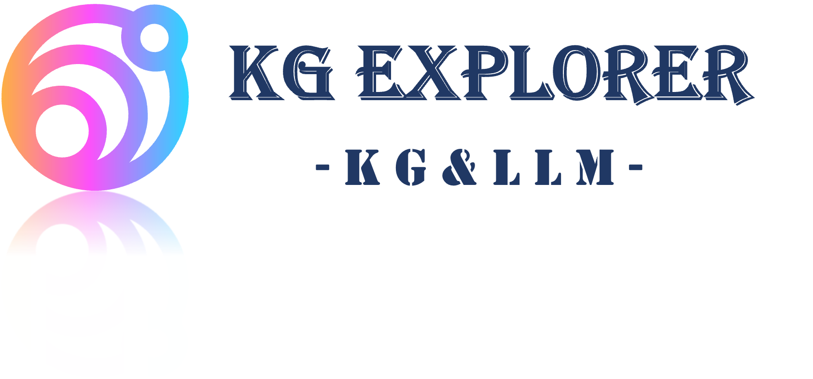

   
  
   &emsp; &emsp; 本项目旨在结合知识图谱技术和先进的大语言模型，构建一个智能问答系统。它将利用知识图谱的结构化信息和大语言模型的自然语言理解能力，深入理解用户提出的问题，并提供准确、有逻辑性的回答。通过整合两大技术，我们将构建一个功能强大、垂直领域适用的智能问答系统，为用户提供卓越的体验。

#### 1 项目模型框架

- 知识图谱是一种有向图，将实体、属性和它们之间的关系表示为节点和边。它能够为系统提供结构化的知识，从而提高问题理解的准确性。知识图谱的建设和维护是项目成功的基础。要考虑如何收集、整理、更新和扩展知识图谱以满足用户需求。
- 大语言模型具备出色的自然语言理解能力，能够识别和理解用户提出的问题，包括复杂的句法和语义结构。这有助于确保系统准确理解用户的意图。大语言模型为项目提供了强大的自然语言处理能力，使系统能够深入理解用户问题并生成高质量的答案，从而实现了一个智能问答系统的关键功能。

​	**模型框架图如下所示**：

#### 2 数据&模型

##### 2.1知识图谱三元组：

三元组是知识图谱的一种通用表示方式，即$G \in (E,R, S)$，其中$E= \{e_1 ,e_2 ,...,e_{|E|} \}$是知识库中的实体集合，共包含$| E |$种不同实体； $R= \{r_1 ,r_2 ,...,r_{|R|} \}$是知识库中的关系集合，共包含$| R |$种不同关系；$S \subseteq E \times R\times E$代表知识库中的三元组集合。

*具体实现:*

1. 实体-关系-实体
2. 实体-属性-属性值

**该项目用到的 Medical Data**：[[Medical Data]](./data/medical.json)
